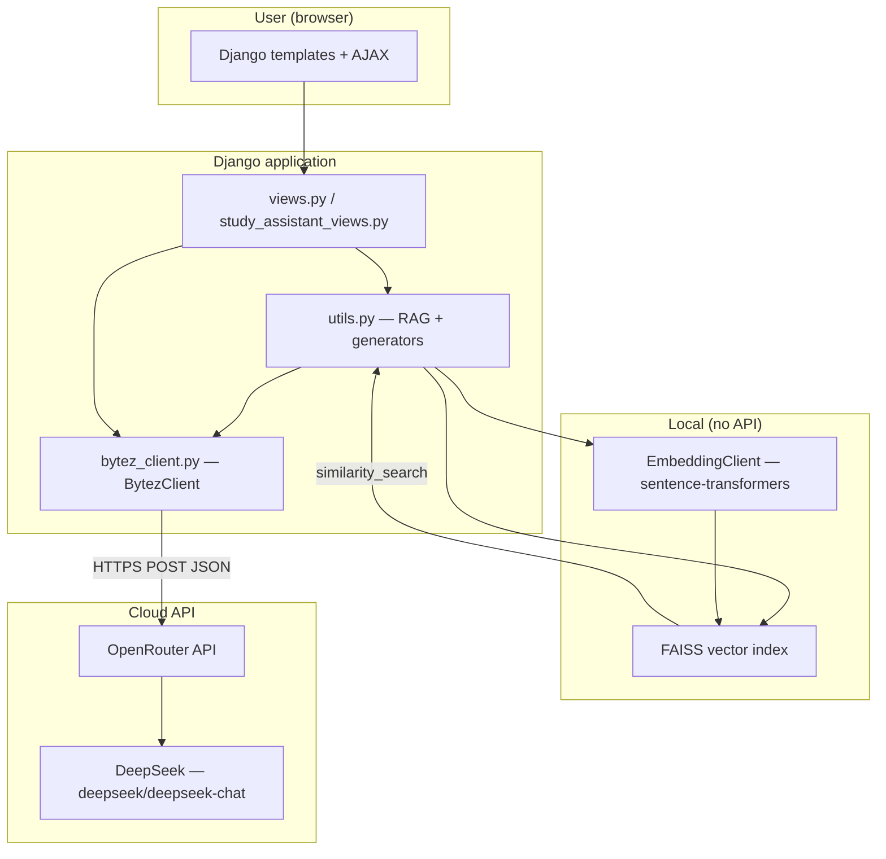
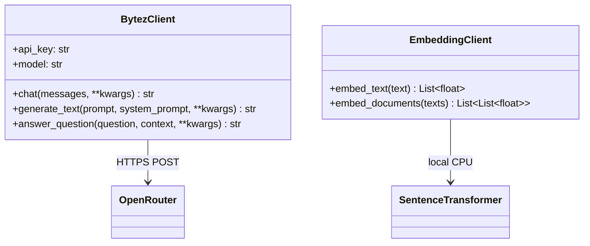
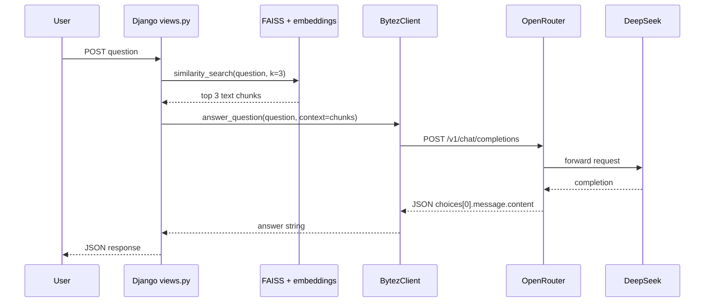

# DeepSeek API Integration — Testa StudyBuddy

This document describes how **DeepSeek** is used in the project, how requests are structured, and how the AI layer fits into the overall system. It is intended for project documentation and supervisor review.

---

## 1. Overview

Testa StudyBuddy uses a **Large Language Model (LLM)** to generate natural-language answers, quizzes, flashcards, summaries, and study guides. The model in production is:

| Item | Value |
|------|--------|
| **Model** | DeepSeek Chat (DeepSeek V3 family) |
| **OpenRouter model ID** | `deepseek/deepseek-chat` |
| **Access method** | [OpenRouter](https://openrouter.ai) — an OpenAI-compatible API gateway |
| **Implementation file** | `testa_app/bytez_client.py` |
| **API key (environment)** | `OPENROUTER_API_KEY` in `.env` |

**Why OpenRouter instead of calling DeepSeek directly?**  
OpenRouter exposes a single, stable **chat completions** endpoint (`/v1/chat/completions`) that matches the format used by OpenAI’s API. The application sends one HTTP POST per generation task; OpenRouter routes the request to DeepSeek’s hosted inference. This keeps the Django code simple (`requests` + JSON) without a separate DeepSeek-specific SDK.

**Why DeepSeek?**  
DeepSeek was selected because it:

- Follows instructions well for **educational** Q&A and explanations  
- Produces reliable **structured JSON** when prompted (needed for quizzes and flashcards)  
- Offers **cost-effective** usage for a student project scale via OpenRouter  

Embeddings (turning text into vectors for document search) are **not** sent to DeepSeek. They run **locally** with `sentence-transformers` (`all-MiniLM-L6-v2`). Only **text generation** uses the DeepSeek model.

---

## 2. High-Level Architecture



**Two-path Q&A flow:**

1. **RAG path (preferred):** User question → FAISS retrieves top document chunks → DeepSeek receives **question + context** → answer grounded in uploads.  
2. **Direct LLM path:** If retrieval fails or returns no useful context → DeepSeek answers with a **system prompt** that explains missing documents or uses general knowledge.  
3. **Fallback:** If the API fails → optional web scrape (`BeautifulSoup`) for a plain-text answer.

---

## 3. Software Structure of the AI Client

The module `testa_app/bytez_client.py` is the **single integration point** for DeepSeek (via OpenRouter). The class is still named `BytezClient` for historical reasons (an earlier version used Bytez); all new code should treat it as the **OpenRouter / DeepSeek client**.

### 3.1 Components

| Component | Role |
|-----------|------|
| `DEFAULT_MODEL` | `"deepseek/deepseek-chat"` — model identifier sent to OpenRouter |
| `OPENROUTER_API_BASE` | `https://openrouter.ai/api/v1/chat/completions` |
| `BytezClient` | Builds requests, handles retries, parses responses |
| `get_bytez_client()` | **Singleton** — one shared client per process (reuses HTTP session) |
| `_get_http_session()` | Shared `requests.Session` with connection pooling (lower latency) |
| `EmbeddingClient` | **Separate** — local embeddings only; no DeepSeek calls |

### 3.2 Class diagram (logical structure)



### 3.3 Public methods

| Method | Purpose |
|--------|---------|
| `chat(messages, **kwargs)` | Low-level: send OpenAI-style `messages` list; returns assistant text |
| `generate_text(prompt, system_prompt=None, **kwargs)` | Builds `system` + `user` messages from strings |
| `answer_question(question, context=None, **kwargs)` | Q&A with educational system prompt and optional RAG context |

**Callers in the project:**

| Caller | File | Usage |
|--------|------|--------|
| `get_conversational_chain()` | `utils.py` | RAG Q&A after FAISS retrieval |
| `question_answer` view | `views.py` | Direct Q&A when RAG chain returns nothing |
| `QuizGenerator` | `utils.py` | JSON quiz generation |
| `FlashcardGenerator` | `utils.py` | JSON flashcard generation |
| `SummaryGenerator` | `utils.py` | Summaries and study guides |

---

## 4. How a Request Works (Protocol & Payload)

### 4.1 HTTP request

- **Method:** `POST`  
- **URL:** `https://openrouter.ai/api/v1/chat/completions`  
- **Headers:**
  - `Authorization: Bearer <OPENROUTER_API_KEY>`
  - `Content-Type: application/json`
  - `HTTP-Referer`, `X-Title` — OpenRouter attribution (project name)

### 4.2 JSON body (structure)

```json
{
  "model": "deepseek/deepseek-chat",
  "messages": [
    { "role": "system", "content": "You are an educational AI assistant..." },
    { "role": "user", "content": "Context:\n...\n\nQuestion:\n..." }
  ],
  "temperature": 0.3,
  "max_tokens": 768
}
```

| Field | Typical value | Meaning |
|-------|----------------|---------|
| `model` | `deepseek/deepseek-chat` | Selects DeepSeek on OpenRouter |
| `messages` | system + user roles | Conversation format (OpenAI-compatible) |
| `temperature` | 0.3 (Q&A), 0.7 (quiz/cards) | Lower = more factual; higher = more varied |
| `max_tokens` | 768–4096 | Caps response length (feature-dependent) |

### 4.3 JSON response (structure)

OpenRouter returns an OpenAI-style object. The client reads:

```json
{
  "choices": [
    {
      "message": {
        "role": "assistant",
        "content": "The generated answer text..."
      }
    }
  ]
}
```

The application extracts: `choices[0].message.content`.  
If `error` is present at the top level, the client raises an exception with that message.

### 4.4 Sequence: question with document context (RAG)



---

## 5. Feature-Specific Use of DeepSeek

### 5.1 Question answering (RAG)

1. `load_vector_store()` loads FAISS index from `faiss_index/`.  
2. `similarity_search(user_question, k=3)` retrieves three relevant chunks.  
3. Context may be truncated (`RAG_CONTEXT_CHAR_LIMIT`) for speed.  
4. `BytezClient.answer_question()` sends context + question with:
   - **Temperature:** `0.3` (more deterministic, factual)  
   - **Max tokens:** `768` (faster responses on Q&A page)  
   - **System prompt:** educational tone + markdown table rules for formatted answers  

### 5.2 Quiz generation

- **Class:** `QuizGenerator` in `utils.py`  
- **Prompt:** asks for **JSON only** with `title` and `questions[]` (MCQ, types, options, correct answer, explanation)  
- **System prompt:** `"Always return valid JSON."`  
- **Temperature:** `0.7`  
- **Post-processing:** Python finds first `{` … last `}` and `json.loads()` the substring  

### 5.3 Flashcard generation

- Same pattern as quizzes: JSON-only prompt, `temperature=0.7`, parse JSON from response.  
- Stored in `Flashcard` model via `study_assistant_views.generate_flashcards`.

### 5.4 Summaries and study guides

- **SummaryGenerator:** `temperature=0.3`, `max_length=2048`  
- **Study guide:** `max_length=4096` for longer structured output (sections, tips, practice questions)  

---

## 6. Reliability & Performance

| Mechanism | Description |
|-----------|-------------|
| **Singleton client** | `get_bytez_client()` avoids creating a new HTTP client per request |
| **Connection pooling** | `HTTPAdapter` on a shared `requests.Session` |
| **Retries** | Up to 2 attempts on timeout, connection error, or HTTP 5xx; backoff 0.75s → 1.5s |
| **Dynamic timeout** | Read timeout scales with `max_tokens` (e.g. longer for study guides) |
| **Logging** | `logging` module at DEBUG for request attempts (not printed to users) |

User-facing errors in `views.py` map API failures to friendly messages (timeout, connection, 401/403, 500).

---

## 7. Configuration

Create a `.env` file in the project root:

```env
OPENROUTER_API_KEY=sk-or-v1-xxxxxxxxxxxxxxxx
```

Optional (legacy / unused for DeepSeek path):

```env
BYTEZ_API_KEY=...
OPENAI_API_KEY=...
```

`python-dotenv` loads `.env` when `bytez_client.py` is imported.

**Security:** Never commit `.env` to Git. Keys are read only from the environment.

---

## 8. Separation of Concerns (for methodology write-ups)

| Layer | Technology | Calls DeepSeek? |
|-------|------------|-----------------|
| Document parsing | PyPDF2, python-docx, python-pptx | No |
| Chunking | LangChain `RecursiveCharacterTextSplitter` | No |
| Embeddings | sentence-transformers `all-MiniLM-L6-v2` | No |
| Vector search | FAISS | No |
| Text generation | DeepSeek via OpenRouter | **Yes** |
| Web fallback | BeautifulSoup | No |

This split is important for academic documentation: the project uses **RAG** (retrieve locally, generate remotely), not a single monolithic “send whole PDF to the API” design.

---

## 9. Design Rationale (summary for reports)

1. **OpenAI-compatible API** — one client implementation for chat completions.  
2. **DeepSeek via OpenRouter** — strong instruction following and JSON for study tools; manageable cost.  
3. **Local embeddings** — privacy-friendly, no per-chunk API cost, lower latency for indexing.  
4. **Centralized client** — all LLM calls go through `bytez_client.py` for consistent prompts, retries, and model selection.  
5. **Structured generators** — quizzes/flashcards depend on parseable JSON; DeepSeek is prompted explicitly and validated with `json.loads()` after extraction.

---

## 10. Related project files

| File | Relevance |
|------|-----------|
| `testa_app/bytez_client.py` | DeepSeek / OpenRouter client implementation |
| `testa_app/utils.py` | RAG, FAISS, `QuizGenerator`, `FlashcardGenerator`, `SummaryGenerator` |
| `testa_app/views.py` | Q&A HTTP endpoint and fallback logic |
| `testa_app/study_assistant_views.py` | Quiz, flashcard, summary, study guide views |
| `METHODOLOGY_NOTES.md` | Broader methodology (RAG, analytics, search) |
| `API_SETUP.md` | Setup steps for `OPENROUTER_API_KEY` |

---

## 11. Suggested wording for thesis / report (optional)

> *The generative component of Testa StudyBuddy is implemented using the DeepSeek large language model (`deepseek/deepseek-chat`), accessed through the OpenRouter API using an OpenAI-compatible chat completions interface. Retrieved document passages from a local FAISS vector index are injected into the user prompt so that answers are grounded in uploaded course material (retrieval-augmented generation). Auxiliary study features—quizzes, flashcards, and summaries—use the same model with task-specific system prompts and JSON-constrained outputs parsed server-side in Django.*

---

*Last updated to match the codebase in `testa_app/bytez_client.py` (OpenRouter + DeepSeek V3).*
